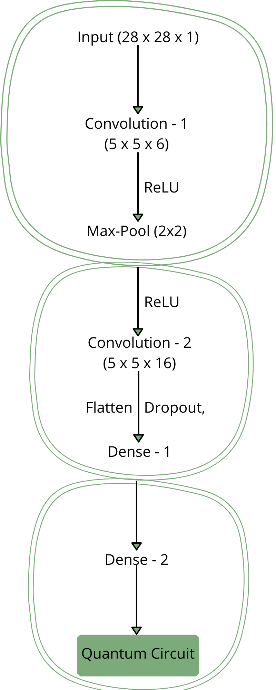
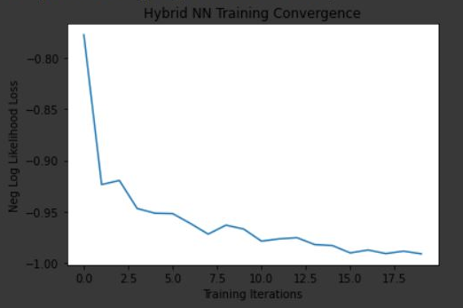
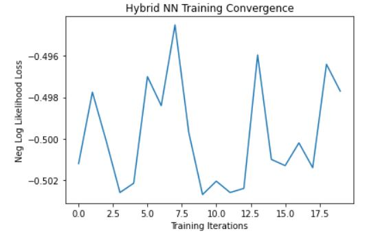
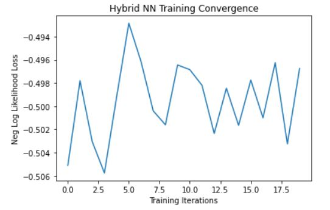

# HybridQNN
This is a repository which contains various quantum-circuits augmented with classical networks for binary classification. 
Their performances are also stored for further comparisons using Qiskit and PyTorch.

At the time of writing this, only six (very) basic circuits and their performances have been added - 
 - `RX`, `RY`, `RZ` on a single qubit
 - Controlled versions of `RX`, `RY`, `RZ` on a single pair
 
 More sophisticated circuits (those making good use of entanglement for example) will be added soon and I shall be giving an analysis of all these results and the potential
 interpretations of why this is the case. However, as a disclaimer, I should also mention that these interpretations (despite being concluded on firm mathematical and intuitive
 foundation) might not be word-perfect and hence any corrections or suggestions are welcomed.
 
 ## Introduction
 Since I am trying to analyse how good a circuit is with respect to being a part of a Hybrid Quantum-Classical Neural Network, I shall not be playing around with the hyperparameters
 or the architecture of the classical Network (unless required for better understanding of more powerful circuits). The details of the classical Network is as follows:
 
  - ### Dataset
I've made use of `MNIST` dataset since they are among the most basic datasets available for analysis and have used only the labels 0 and 1 for binary classification.

 - ### Architecture

  

As one may already see, this is a **pretty** powerful classical network for our purpose in itself, and rightfully so. But it
is important to remember that we are trying to check how potentially useful a quantum circuit is and if despite
having a powerful classical network, we get low test accuracy then we can expect that the quantum circuit is **really** bad.

 - ### Hyperparameters
Just like the architecture, I have chosen hyperparameters that were well enough to handle the learnable features on their own.
1) `learning_rate` = 0.001
2) `adam` optimizer
3) `nn.NLLLoss()`
4) training and testing corpus = 100 and 50 respectively
5) `epochs` = 20
6) `batch_size` = 1
And the not-so-classical hyperparameters which remain constant throughout the experiments:
7) shift parameter = &pi;/2, the [recommended](https://arxiv.org/abs/1811.11184) way to caculate a quantum gradient.
8) `shots` = 100
9) `aer_backend` = `qasm_simulator` , the device upon which we will run our quantum circuit on.

##  To Reproduce the results
One can easily reproduce the results by cloning and making the following minor changes:
1) In `main.py` make sure the correct circuit is called, default cirucit is set to `circuit_ry.py`
2) Make sure that the train and test data are pointing towards the correct local directory, set `download = True` to get the MNIST dataset.
3) I have not added any code to print the graph, but one can easily do that as well by calling `plt.plot()` on `loss_list` in `main.py`

## Analysis
We wil try and figure out what might be the potential(and sometimes obvious) reasons behind the performance of a circuit by _comparing_ similar models(`RX`, `RY`, `RZ`) as well 
as comparing them their controlled cousins.
 - ### `RX`, `RY` and `RZ` :
  The simpliest of circuits, This is a single-qubit circuit where a hadamard precedes the rotational gates
  one might not be very surprised to see that `RY` tremendously outperforms it's counterparts. Here's What their Negative-Log Likelihood Loss Graphs look like:
  
  
  
      
