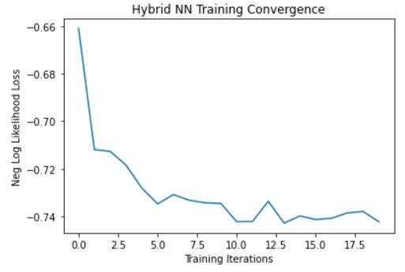

# HybridQNN
This is a repository which contains various quantum-circuits augmented with classical networks for binary classification using Qiskit and PyTorch. 
Their performances are also stored for further comparisons and analysis.

At the time of writing this, only six (very) basic circuits and their performances have been added - 
 - `RX`, `RY`, `RZ` on a single qubit
 - Controlled versions of `RX`, `RY`, `RZ` on a single pair
 
 More sophisticated circuits (those making good use of entanglement for example) will be added soon and I shall be giving an analysis of all these results and the potential
 interpretations of why this is the case. However, as a disclaimer, I should also mention that these interpretations (despite being concluded on firm mathematical and intuitive
 foundation) might not be word-perfect and hence any corrections or suggestions are welcomed.
 
 ## Introduction
 Since I am trying to analyse how good a circuit is with respect to being a part of a Hybrid Quantum-Classical Neural Network, I shall not be playing around with the hyperparameters
 or the architecture of the classical Network (unless required for better understanding of more powerful circuits). The details of the classical Network is as follows:
 
  - ### Dataset
I've made use of `MNIST` dataset since they are among the most basic datasets available for analysis and have used only the labels 0 and 1 for binary classification.

 - ### Architecture

  

As one may already see, this is a **pretty** powerful classical network for our purpose in itself, and rightfully so. But it
is important to remember that we are trying to check how potentially useful a quantum circuit is and if despite
having a powerful classical network, we get low test accuracy then we can expect that the quantum circuit is **really** bad.

 - ### Hyperparameters
Just like the architecture, I have chosen hyperparameters that were well enough to handle the learnable features on their own.
1) `learning_rate` = 0.001
2) `adam` optimizer
3) `nn.NLLLoss()`
4) training and testing corpus = 100 and 50 respectively
5) `epochs` = 20
6) `batch_size` = 1
And the not-so-classical hyperparameters which remain constant throughout the experiments:
7) shift parameter = &pi;/2, the [recommended](https://arxiv.org/abs/1811.11184) way to calculate a quantum gradient.
8) `shots` = 100
9) `aer_backend` = `qasm_simulator` , the device upon which we will run our quantum circuit on.

##  To Reproduce the results
One can easily reproduce the results by cloning and making the following minor changes:
1) In `main.py` make sure the correct circuit is called, default cirucit is set to `circuit_ry.py`.
2) Make sure that the train and test data are pointing towards the correct local directory, set `download = True` to get the MNIST dataset.
3) I have not added any code to print the graph, but one can easily do that as well by calling `plt.plot()` on `loss_list` in `main.py`.

## Analysis
We wil try and figure out what might be the potential(and sometimes obvious) reasons behind the performance of a circuit by _comparing_ similar models(`RX`, `RY`, `RZ`) as well 
as comparing them with their controlled cousins.
 - ### (Update) Wait, why is the value of `shift` &pi;/2 ?:
 
   I feel like I glanced over the fact that the value of shift in the code is `np.pi/2` without explaining the reasoning behind it. This value is not necessarily &pi;/2 and is supposed to be calculated for every parameterized gate. Even though I have provided the research papaer that talks about it extensively, I feel I should've provided a brief overview for those who find it overwhelming.
   
   Suppose we have a single parameterized gate UG(&theta;) = e(-i&theta;aG), where
   
    `G` is the Hermetian matrix in our parameterized gate.
    `a` is a constant, usually written in conjugation with &theta;
    
   It can be shown that it can be also be written as: e(-i&theta;aG) = cos(a&theta;)I - isin(a&theta;)G
   
   The above notation must seem similar to those who have seen Rotation gates before,
    Rp(&theta;) = cos(&theta;/2)I - isin(&theta;/2)P
    where P = `X`, `Y`, `Z` depending upon which Pauli rotation one wants. `I` here is identity matrix and the value of `a=0.5`.
    
   Indeed, G can be either be of `X`, `Y`, `Z` depending upon your choice of gate.
   
   The expectation value of a measurement can be written as:

 

   where A is the observable for any state |&psi;&rangle;. What we want is &delta;f(&theta;) with respect to &theta; which can be estimated as follows:
   

  Where `r` can be calculated by the formula:

 

Where e1 and e2 are the eigenvalues of the Hermetian matrix `G` and `a` is the before mentioned constant. Now one can see why the shift parameter of all three gates remains to be &pi;/2, its simply because all three pauli matrices have same eigenvalue of +1 and -1. So, `r=0.5` and hence our shift, which is &pi;/4r becomes &pi;/2. 
 
 - ### `RX`, `RY` and `RZ` :
 
  The simpliest of circuits, This is a single-qubit circuit where a hadamard precedes the rotational gates and
  one might not be very surprised to see that `RY` tremendously outperforms it's counterparts. Here's What their Negative-Log Likelihood Loss Graphs look like(for `RX`, `RY` and `RZ` respectively):
  
 
  

 
 We should first try and understand why does `RY` perform fantastically? The answer to it lies in the same reason as that to why `RX` or `RZ` perform so poorly. Let us first start by looking at the Matrix form of `RY`:
 

  

 
 Well, that doesn't help us in any direct way. Perhaps I should also write down the `RX` and `RZ` matrices:
 
 

                    
 

                    
Upon noticing these three matrices, one who isn't even well-versed with QC can see one major difference between `RY` and it's siblings - the lack of iota. How does that affect
our analysis? One can see the obvious implications of this once we write down how these gates are acting on the  state:

Things might be much clear at this point, we can intuitively say that the gate which allows for more flexibility in terms of possible values of _expectation_ value of measurement is better in terms of adapting a parameter. This parameter can be thought of as a switch 'ON' or 'OFF' button which closes if previous layers detect a closed loop (corresponding to the number '0') and stays open otherwise.

`RX` is definitely a poor choice of gate in this case since all it does is add a global phase to the state which has zero contribution to the expectation value, since there is
no relative change in the probability of the output(which is only 0 or 1, fyi). We can make use of this gate in interesting ways, one of which _might_ be using `RX` for phase kickback rather than using it as the sole decision maker.

`RZ` on the otherhand looks very enticing. It seems like we are actually changing the (relative) probabilitiies of these states but upon second consideration we can tell that this is a facade too, since despite having different values of &theta; in the power of e, we can see that the mod of both the terms makes it 1, hence contributing nothing to the
expectation value. Just like `RX`, we could probably make use of `RZ` gate in a more sophisticated way to make use of its 'different-values but same mod' feature.

`RY` does the job because it can do what the above gates couldn't. It can make use of appropiate &theta; to get rid of either |0&rangle; or |1&rangle; completely(not simultaneously, of-course). For a value of &theta; = &pi;/2 we can eliminate |0&rangle; and for a value &theta; = 3&pi;/2 we can get rid of |1&rangle;. Whereas this doesn't happen in the other two cases which can be verified easily using a pen and a paper and therefore I shall be skipping it because writing them here is cumbersome.

One can further verify the above reasoning by either increasing `epochs` or by further decreasing sample-size of testing. `RX` and `RZ` have no performance upgradation and hangs
around the same numbers as before.

- ### `CRX`, `CRY` and `CRZ` :

We can believe without an inch of a doubt that the above assessment stands true for their controlled cousins as well. This may not come of as a surprise since we expected an additional control qubit to add more entropy to the expectation value, here are the graphs for `CRX`, `CRY` and `CRZ` respectively:

 
  

What might be interesting is to compare the performance of a controlled gate with a non-controlled one. Let us take `CRY` and `RY` as a running example. Upon first inspection, we cannot really see much difference in their graphs. While the same general pattern seems to exist in both gates, we can see that `RY` outperforms `CRY` in terms of having an even lower loss value which touches -1.0 whereas in the latter case we have stagnated over -0.76. This observation further enforces our hypothesis that the control qubit adds an additional constraint which is satisifed only 50% of the time by the virtue of presence of a Hadamard gate and hence only when the control qubit is in the state 1 we can expect the rotation of `RY` to occur. We can do the same with other gates but since they already don't show any progress we cannot expect an additional control qubit to differ from the perceived (already present) randomness.
